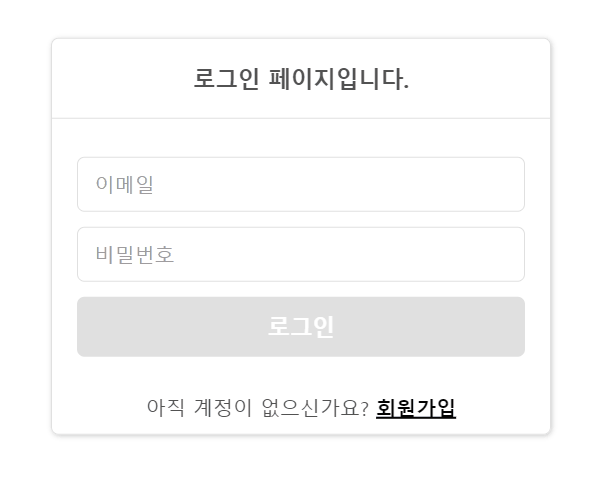
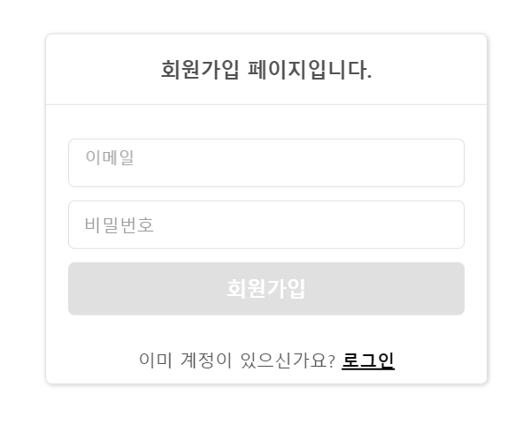
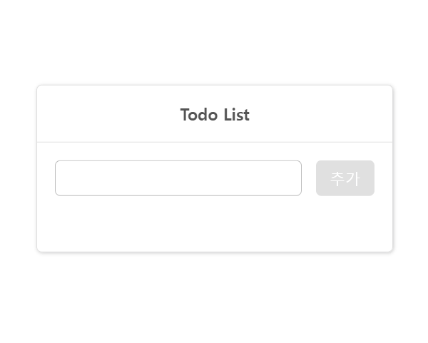

## 1. 프로젝트 실행 방법  
  **Git Clone** -> `npm ci` 또는 `npm install` -> `npm start`
  
  혹은  
  
  **[🔗웹사이트](https://wanted-pre-onboarding-frontend-nine-inky.vercel.app/ 'https://wanted-pre-onboarding-frontend-nine-inky.vercel.app/') 접속**  
  

 

## 2. 개발언어 및 라이브러리  
  
  - 개발언어: Typescript
  - 설치한 라이브러리: React, React-Router, Styled-Components
 

## 3. Preview
  1. 회원가입 유효성 검사
  
    
  2. 회원가입 중복 이메일
  
    
  3. 회원가입 완료 및 로그인
  
    
  4. Todo 리스트 추가/삭제/수정
  
    
  5. Todo 리스트 페이지 새로고침
  
    
  6. 리디렉션
  
